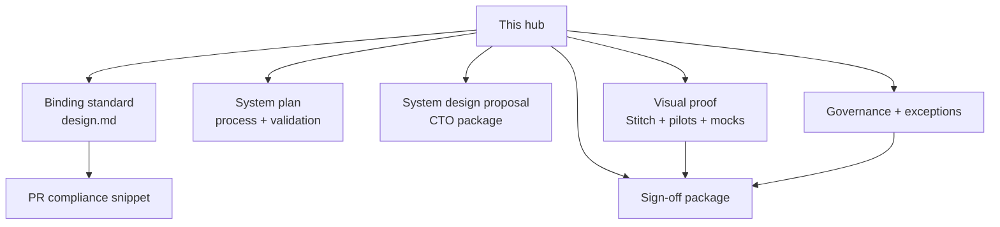

# UI/UX System Proposal Plan

## Priority map (review order)

| Priority | Page | Role |
| --- | --- | --- |
| **P0** | This hub (**1 ·**) | Single entry: summary, visuals, checklist |
| **P0** | [UI/UX guidelines](../UI%20UX%20guidelines%2020be6c5f913d4f53ac0e76eb5e904eef.md) | Binding **`design.md`** for all implementation |
| **P1** | [3 · UI/UX system plan — process & validation (SSOT)](../Process%20&%20Governance/3%20%C2%B7%20UI%20UX%20system%20plan%20%E2%80%94%20process%20&%20validation%20(SSOT%203374544eeb42810f9015e8d48d5453af.md) | How we spec, mock, validate (process SSOT) |
| **P1** | [2 · System design proposal — CTO review package](https://www.notion.so/2-System-design-proposal-CTO-review-package-d9fc7ae92aa9477c96677c2fde5d69ad?pvs=21) | CTO review package + milestones |
| **P2** | [4 · UI/UX exceptions log — approved deviations](../Process%20&%20Governance/4%20%C2%B7%20UI%20UX%20exceptions%20log%20%E2%80%94%20approved%20deviations%2042cc3261a0d84faaaf6420c0061d7f71.md) | Exceptions only (logged + approved) |
| **P2** | [5 · UI/UX governance — PM execution playbook](../Process%20&%20Governance/5%20%C2%B7%20UI%20UX%20governance%20%E2%80%94%20PM%20execution%20playbook%20e112617dc0d74306a44fe55ac121ef52.md) | Governance / PM execution |
| **P3** | [6 · Milestone 5 — CTO sign-off package ([design.md](http://design.md) v1.0)](https://www.notion.so/6-Milestone-5-CTO-sign-off-package-design-md-v1-0-7c2b8ee31c6e4ab7a19744b5f9de10f2?pvs=21) | Sign-off / decision record |
| **P4** | Subpages **7–9** under this hub | Design catalog, working plan, meeting notes |

<aside>
📌

**Sidebar:** Titles **1 ·** through **6 ·** under the CTO standard sort in **review order**. **7–9** are nested under this hub.

</aside>

<aside>
👋

**For Jorge** — This is the **one page** that ties together standards, process, **visual proof**, governance, and sign-off. Everything below links to the underlying docs; you should not need to hunt across the workspace for the full story.

**Goal for this review:** confirm **`design.md`** as binding, approve the **exceptions + governance** model, and align on the **sign-off path**.

</aside>

## Visual preview (on-page mocks)

Representative screens for the two pilots (same intent as [2 · System design proposal — CTO review package](https://www.notion.so/2-System-design-proposal-CTO-review-package-d9fc7ae92aa9477c96677c2fde5d69ad?pvs=21)). Screens below are the on-page reference; detailed mock files live in the Design repo.

Executive Dashboard — Overview representative

Prediction Market — Markets list representative

**Interactive prototype:** [Stitch — Prediction Market](https://stitch.withgoogle.com/preview/9779729415150906015?node-id=56f42087f00f4ecb9bac636767e5847c)

---

## Executive summary (what we standardized)

- **Single standard** for how every Aosenuma product does UI: **ShadCN-first**, **tokenized** styling, **WCAG 2.1 AA** target, mandatory **Loading / Empty / Error / Success**, and **PR-level** compliance.
- **Single process** for requirements: spec categories, **mockups tied to requirements**, and **validation gates** before build, merge, and release (see system plan).
- **Proof, not only prose:** live **Stitch** prototype for Prediction Market, **Exec Dashboard** pilot spec, plus **static HTML mockups** in the Design repo for screenshots.
- **Governance:** exceptions are **logged and approved**; CTO path is packaged for **review and sign-off**.
- **Phased documentation work:** Follow **Rollout plan (phased execution)** on [UI/UX guidelines](../UI%20UX%20guidelines%2020be6c5f913d4f53ac0e76eb5e904eef.md) (inventory → Figma visuals → buttons → written rules → stakeholders). Open actions: **Open documentation actions (by phase)** on that page.

---

## How the pieces connect

---

## 1. Binding UI/UX standard (source of truth for implementation)

**Primary page:** [UI/UX guidelines](../UI%20UX%20guidelines%2020be6c5f913d4f53ac0e76eb5e904eef.md)

- CTO-facing view of **`design.md`**: what engineering must follow in code.

---

## 2. Org-wide UI/UX system plan (how we spec, mock, and validate)

**Notion:** [3 · UI/UX system plan — process & validation (SSOT)](../Process%20&%20Governance/3%20%C2%B7%20UI%20UX%20system%20plan%20%E2%80%94%20process%20&%20validation%20(SSOT%203374544eeb42810f9015e8d48d5453af.md)

**Repo file (canonical detail for engineering and AI agents):** `UI-UX-SYSTEM-PLAN.md` at the **Design** workspace root.

- Covers requirement **categories**, **mock workflow**, **validation gates**, onboarding, RACI.

---

## 3. CTO review package (narrative + links)

**Page:** [2 · System design proposal — CTO review package](https://www.notion.so/2-System-design-proposal-CTO-review-package-d9fc7ae92aa9477c96677c2fde5d69ad?pvs=21)

- Executive narrative, milestones, **visuals section** (Stitch, pilots, HTML mockup paths), and links to all system components.

---

## 4. Visual proof and mockups (what stakeholders can *see*)

### Interactive prototype (Prediction Market)

- **Stitch (canonical mocks):** [Open Stitch preview](https://stitch.withgoogle.com/preview/9779729415150906015?node-id=56f42087f00f4ecb9bac636767e5847c)

### Pilot specs (builder-ready)

- Exec Dashboard pilot: [Pilot output — [design.md](http://design.md) on Exec Dashboard (Overview + KPI Card)](../Projects/Pilot%20output%20%E2%80%94%20design%20md%20on%20Exec%20Dashboard%20(Overvi%20cba1b3756c52481aa0f981510bb02fd6.md)
- Prediction Market pilot: [Pilot Output — Prediction Market UI/UX (Stitch screens + core components)](../Projects/Prediction%20Market%20UI%20UX%20and%20Wireframes/Pilot%20Output%20%E2%80%94%20Prediction%20Market%20UI%20UX%20(Stitch%20scr%205db59aa8d3564be48cd230672972eae6.md)

### Static HTML previews (open in browser, then screenshot for Notion)

- `Design/mockups/exec-dashboard-overview-proposal-mockup.html` (source for screenshots)
- `Design/mockups/prediction-market-markets-list-mockup.html` (source for screenshots)

### Reference design catalog (from spreadsheet import)

[7 · Design catalog — reference index (CSV import)](../Workflow%20&%20Tooling/7%20%C2%B7%20Design%20catalog%20%E2%80%94%20reference%20index%20(CSV%20import)%203374544eeb4281839c3fd35dde864187.md)

---

## 5. Governance and exceptions

- Exceptions log (approved deviations): [4 · UI/UX exceptions log — approved deviations](../Process%20&%20Governance/4%20%C2%B7%20UI%20UX%20exceptions%20log%20%E2%80%94%20approved%20deviations%2042cc3261a0d84faaaf6420c0061d7f71.md)
- PM execution / governance playbook: [5 · UI/UX governance — PM execution playbook](../Process%20&%20Governance/5%20%C2%B7%20UI%20UX%20governance%20%E2%80%94%20PM%20execution%20playbook%20e112617dc0d74306a44fe55ac121ef52.md)
- Other governance pilots and standards (expand)
    - UI/UX Standards (CTO View) deep link above is the parent of this hub.
    - Pilot references also appear inside the System design proposal.

---

## 6. Sign-off and decision record

- Milestone 5 / CTO sign-off package: [6 · Milestone 5 — CTO sign-off package ([design.md](http://design.md) v1.0)](https://www.notion.so/6-Milestone-5-CTO-sign-off-package-design-md-v1-0-7c2b8ee31c6e4ab7a19744b5f9de10f2?pvs=21)

---

## 7. Assignments and working sessions (context from Jorge)

- UI/UX Process Assignment (meeting notes): [Meeting notes — UI/UX Process Assignment](Meeting%20notes%20%E2%80%94%20UI%20UX%20Process%20Assignment%2032f4544eeb4280ab94f8e96b8ab696ae.md)
- Working plan derived from that assignment: [8 · Working plan — UI/UX process (from Jorge assignment)](8%20%C2%B7%20Working%20plan%20%E2%80%94%20UI%20UX%20process%20(from%20Jorge%20assig%203374544eeb428142ac89e6c06ce1db5e.md)

---

## 8. Quick decision checklist (for review)

- [ ]  Standard (`design.md`) acceptable as **binding** for all new UI?
- [ ]  **Exceptions process** acceptable?
- [ ]  **Visual proof** sufficient (Stitch + pilots + mockups path), or are more **screens on this hub** needed?
- [ ]  Ready to proceed using **System design proposal** agenda for sign-off?

---

<aside>
📎

**Bookmark this page** as the entry point. Detailed pages stay separate so engineering can deep-dive without duplicating content; this hub is the **presentable layer** for executive review.

</aside>