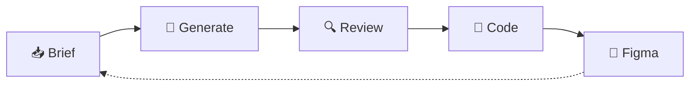

# 6 · Workflow — Claude Design → Claude Code

<aside>
⚙️

**Operating loop** for the aosenuma design system. **Claude Design** (Anthropic, research preview — Apr 2026) is the **conversational front-end** between a brief and shipped code. This page does **not** replace the hub or the Figma library; it sits **between brief and code** and is **bound** by the same tokens, states, semantic color, and governance defined in chapters 1 → 5 of [UI/UX guidelines](../UI%20UX%20guidelines%2020be6c5f913d4f53ac0e76eb5e904eef.md).

</aside>

## TL;DR

- **Briefs** (ch. 1) → **Claude Design** generates against the onboarded **aosenuma** system (ch. 2) → reviewers refine against state matrices (ch. 4) and visual proof (ch. 3) → **one-command handoff to Claude Code** for ShadCN-first implementation (ch. 5) → frames **mirrored back** into the **canonical Figma library** so design, code, and Notion stay one system.
- **Status:** research preview. Treat Claude Design as **assistive**; the hub + Figma library remain **binding**.
- **Owner:** Shreyas Shirke (UI/UX Standards Owner).

## Why this exists

Claude Design (launched Apr 2026, research preview) generates UI from natural language, can analyze a codebase + design files to **infer a custom design system**, and ships finished frames to **Claude Code** with one command. Without explicit guardrails, an AI design tool will drift into generic blue / Material UI defaults. This page binds Claude Design to the **aosenuma standard** so its output is shippable from day one.

## Inputs — single source of truth

| Source | What it provides | Reference |
| --- | --- | --- |
| **Spec hub** | Entry, principles, semantic color (non-negotiable), buttons-at-a-glance | [UI/UX guidelines](../UI%20UX%20guidelines%2020be6c5f913d4f53ac0e76eb5e904eef.md) |
| **Ch. 1 — Scope & principles** | UI element inventory, *New project / new frame checklist (Apr 14 baseline)* | [1 · Scope & principles](../Standards/1%20%C2%B7%20Scope%20&%20principles%203454544eeb42810c89b3d3e4ef563c43.md) |
| **Ch. 2 — Brand, layout & tokens** | Semantic palette, gradient (135° **#164F5B → #208692**), typography, 8pt grid, radius, shadows, *Visual swatches* | [2 · Brand, layout & tokens](../Standards/2%20%C2%B7%20Brand,%20layout%20&%20tokens%203454544eeb4281ce92bbf7eb90df3835.md) |
| **Ch. 3 — Style Card for UI/UX** | *Embedded pattern gallery* — visual proof for hero, chrome, cards, CTAs, accent discipline | [3 · Style Card for UI/UX](../Standards/3%20%C2%B7%20Style%20Card%20for%20UI%20UX%203454544eeb428013a31df04ad5caa2e2.md) |
| **Ch. 4 — Components & patterns** | Authoritative button state matrix, accessibility, content rules | [4 · Components & patterns](../Standards/4%20%C2%B7%20Components%20&%20patterns%203454544eeb4281479040ce5bd99406c7.md) |
| **Ch. 5 — Governance & shipping** | PR checklist, exceptions log, sign-off | [5 · Governance & shipping](../Process%20&%20Governance/5%20%C2%B7%20Governance%20&%20shipping%203454544eeb4281808c68e067d0b6a0f7.md) |
| **Code** | `globals.css`  • ShadCN/Tailwind primitives (token names must match in design) | repo |
| **Figma library** | Canonical mirror of tokens + components | (link in ch. 2 once published) |

## Visual: the loop at a glance



1. 📥 **Brief** — write the ask
2. 🎨 **Generate** — Claude Design creates frames
3. 🔍 **Review** — check tokens, states, a11y
4. 🚀 **Code** — hand off to Claude Code
5. 🔁 **Figma** — mirror back to the library

## The loop — step by step

### 0 · Onboard Claude Design (one-time per project)

**Goal:** make Claude Design speak aosenuma, not generic UI-kit blue.

- Point Claude Design at the **repo** so it learns ShadCN + Tailwind variants and reads `globals.css` token names.
- Upload (or link) the hub + chapters **2 · Brand, layout & tokens** and **4 · Components & patterns** so the inferred system matches the **Semantic color** table.
- **Confirm inferences:** ask Claude Design to enumerate the system it learned; verify it lists primary `#208692`, deep `#164F5B`, destructive `#DC2626` (hover `#B91C1C`), success `#16A34A`, warning `#F59E0B`, info `#3B82F6`, gradient **135° #164F5B → #208692**, default radius **12px**, 8pt grid.
- If anything is off → re-upload the relevant chapter, re-prompt, and **do not proceed** until inference matches.

<aside>
🛡️

**Hard stop:** if Claude Design infers a different primary or proposes a blue accent, do **not** start step 1. Re-onboard.

</aside>

### 1 · Brief — capture intent

- Plain language **or** import (PRD, Notion page, web capture, screenshot).
- Use **named elements** from the **UI element inventory** in [1 · Scope & principles](../Standards/1%20%C2%B7%20Scope%20&%20principles%203454544eeb42810c89b3d3e4ef563c43.md): e.g. *“KPI card”*, *“directory grid card”*, *“slide-over panel”*, *“filter sidebar”*.
- Include **breakpoint** (Desktop 1440 / Tablet 1024 / Mobile 375) and **density context** (admin dashboard vs. marketing vs. consumer card).
- Reference **acceptance criteria** that already exist as rules — “follow the *Authoritative button state matrix* in ch. 4 for any button on this screen”.

### 2 · Generate — initial frames

- Claude Design returns layout + components from the **onboarded system**.
- **Reject** any frame that ships:
    - **Raw hex** instead of token names
    - **Off-token spacing** (anything outside 4 / 8 / 16 / 24 / 32 / 48 / 64)
    - **Non-ShadCN variants** without an exception filed
    - **Generic blue** primary or shadows tinted blue
- Re-prompt with the token name (“use `primary` and `border` tokens; use 32px horizontal padding on the CTA”).

### 3 · Refine — apply rules

Use inline comments + AI sliders to enforce:

- **Spacing:** snap to 8pt grid; default radius **12px** unless excepted.
- **Button states:** every variant must show **default · hover · pressed · focus · disabled · loading** (and **selected** where relevant) per ch. 4.
- **Sizing:** heights **48 / 40 / 32**; large CTA padding **32px** horizontal; **touch target ≥ 44×44px**.
- **Semantic color:** red **only** for destructive/blocking; teal `#208692` for CTA/links/focus; warning amber, success green, info calm-blue. Any divergence → exception.
- **Accessibility:** keyboard path, **visible focus ring**, contrast, motion-respect.

### 4 · Visual cross-check

- Compare frames against **Style Card** PNGs / **Visual swatches** in ch. 2 and ch. 3 (hero gradient, chrome, cards on background, primary vs. secondary CTAs, accent discipline, semantic states).
- **Apr 14 reviewer bar:** open the **embedded Figma / dated PNG**, not generated placeholder tiles.
- For dense surfaces, verify against the documented **density / hierarchy** for that pattern; do not assume one global hierarchy.

### 5 · Handoff to Claude Code

- Use Claude Design’s **one-command bundle** to send the design to **Claude Code**.
- Claude Code writes **ShadCN-first** code into the repo (or a feature branch).
- Open a PR using the standard checklist from [5 · Governance & shipping](../Process%20&%20Governance/5%20%C2%B7%20Governance%20&%20shipping%203454544eeb4281808c68e067d0b6a0f7.md):
    - [ ]  **Tokens** (no orphan hex on shipped UI)
    - [ ]  **ShadCN-first** (or logged exception in `docs/design-exceptions.md`)
    - [ ]  **States** present on relevant surfaces and controls
    - [ ]  **Accessibility** verified (keyboard / focus / contrast / motion)
    - [ ]  **Figma frame** linked (canonical library)
    - [ ]  **`design.md` reference** linked

### 6 · Mirror back to Figma + per-project compliance

- Export final frames into the **canonical Figma library** so Dev Mode token names stay aligned with code.
- Update the project’s **UI/UX Compliance** page with the new frames + which spec sections they satisfy (Apr 14 baseline checklist).
- If new tokens or new component variants emerged, file them through governance (ch. 5) before they become “the new normal.”

## Mapping to the phased rollout (A–E)

| Phase | Where it lands in the loop |
| --- | --- |
| **A — Inventory & categories** | Step **1 · Brief** — element names feed prompts; missing items return to ch. 1. |
| **B — Visual color & gradients** | Steps **0 · Onboard**  • **4 · Visual cross-check** — palette + gradient validated against Style Card. |
| **C — Buttons → other components** | Step **3 · Refine** — every variant shows the full state matrix from ch. 4. |
| **D — Written rules tied to visuals** | Steps **3 + 4** — each frame links back to the rule it satisfies (do/don’t in ch. 4). |
| **E — Stakeholder closure** | Step **4** — live Claude Design sessions can replace some review meetings; stakeholders react in-context. |

## Guardrails — do not bypass

<aside>
⚠️

**These are the same non-negotiables from chapters 2 and 4.** A Claude Design frame that breaks any of them is **not shippable** without an exception in `docs/design-exceptions.md`.

</aside>

- **Semantic color is law:** red **only** for destructive/blocking errors; teal `#208692` for CTA/links/focus; warning amber, success green, info calm-blue per the **Semantic color** table.
- **Tokens, not hex:** Claude Design output must reference token names. Raw hex on shipped UI = bug.
- **Only the approved gradient:** **135°, #164F5B → #208692** — no decorative one-offs.
- **States required:** loading / empty / error / success on surfaces; full interaction matrix on controls.
- **Accessibility:** keyboard path, visible focus, contrast, motion-respect — verified before step 5.
- **Spacing & radius:** 8pt grid; default radius **12px** (`--radius` 0.75rem) unless excepted.
- **Figma matches code:** semantic variables and component names mirror `globals.css` and the implementation library.

## Templates — copy/paste into Claude Design

- 📥 Onboarding prompt (run once at step 0)
    
    ```
    You are designing inside the aosenuma design system. Use ONLY these tokens and rules:
    
    Semantic color (non-negotiable):
    - primary: #208692 (default), #164F5B (hover/dark) — CTAs, links, focus
    - success: #16A34A — confirmation, completed
    - warning: #F59E0B — non-blocking risk, missing required info
    - destructive: #DC2626 (base), #B91C1C (hover) — blocking errors, irreversible danger
    - neutral/muted: #6B7280 text, #D1D5DB border, #F3F4F6 bg
    - info: #3B82F6 — informational only, never errors/warnings
    
    Gradient (only one approved): linear 135deg, #164F5B → #208692.
    
    Layout: 8pt grid (4/8/16/24/32/48/64). Default radius 12px. Touch target ≥ 44×44px.
    
    Button heights: 48 / 40 / 32. Large CTA horizontal padding: 32px.
    
    Use ShadCN component variants (primary, secondary, ghost, destructive). Do not invent new variants without a logged exception.
    
    Never use raw hex on shipped UI; always reference token names. Never use blue as primary; never use red for non-destructive emphasis.
    ```
    
- 📝 Brief template (step 1)
    
    ```
    Screen: <name>
    Project: <Executive Dashboard | Woodside | StakeAI | RapdAI | …>
    Breakpoint(s): Desktop 1440 / Tablet 1024 / Mobile 375
    Density context: <admin dashboard | marketing | consumer card>
    
    Goal: <user job in one sentence>
    
    Elements (from UI element inventory, ch. 1):
    - <e.g. KPI card x4>
    - <e.g. directory grid card x12>
    - <e.g. slide-over panel — 480px>
    
    States required: default / hover / focus / pressed / disabled / loading / empty / error / success
    
    Must follow:
    - Authoritative button state matrix (ch. 4)
    - Semantic color (ch. 2 + hub)
    - 8pt grid + 12px radius
    ```
    
- ✅ Refinement checklist (step 3, paste before handoff)
    - [ ]  All colors are token names (no raw hex)
    - [ ]  Spacing snaps to 4/8/16/24/32/48/64
    - [ ]  Default radius 12px (or exception)
    - [ ]  All button states present (default/hover/pressed/focus/disabled/loading)
    - [ ]  Focus ring visible and uses `ring` token
    - [ ]  Hit area ≥ 44×44px on every interactive control
    - [ ]  Red used only for destructive/blocking errors
    - [ ]  Only the approved gradient (135° #164F5B → #208692) where used
    - [ ]  Surface states designed (loading/empty/error/success)
    - [ ]  Accessibility: keyboard path + contrast verified
    - [ ]  Figma library exists or will be updated in step 6

## Governance & privacy

- **Owner:** Shreyas Shirke (UI/UX Standards Owner). Stakeholder: Karla Hidalgo.
- **Pilots (suggested):** **Executive Dashboard** for ch. 4 components; **Woodside** for ch. 2 tokens. Run one screen end-to-end (steps 0 → 6) before scaling.
- **Privacy posture:** Claude Design stores **design-system representations** (not raw source files); when linked to a codebase, repo data stays local and is **not used to train Anthropic models**. Enterprise admins can keep the tool **disabled by default**.
- **Exceptions:** any Claude Design output that breaks tokens, states, semantic color, or gradient rules is logged in **`docs/design-exceptions.md`** with screenshot + reason, per chapter [5 · Governance & shipping](../Process%20&%20Governance/5%20%C2%B7%20Governance%20&%20shipping%203454544eeb4281808c68e067d0b6a0f7.md).
- **Status:** research preview (Apr 2026). Treat Claude Design as **assistive**; the hub + Figma library remain the **binding** sources.

## Known limitations (Apr 2026)

- **Multiplayer collaboration** is not full-featured — coordinate edits async per project.
- **Editing experience has rough edges** — re-prompt + re-generate is sometimes faster than micro-edits.
- **Best with a clean codebase** — onboarding quality scales with how well `globals.css` + ShadCN variants are documented.
- **Not an automatic Notion ↔ Figma sync** — step 6 (mirror back) is still a deliberate export.

## FAQ

**Does Claude Design replace Figma?**  No. Figma remains the **canonical library** and the SSOT for **handoff in Dev Mode**. Claude Design is the conversational generation + refinement layer.

**Does Claude Design replace this hub?**  No. The hub + chapters 1 → 5 are the **binding** spec; Claude Design must be onboarded against them.

**What if Claude Design proposes a new variant or token?**  Treat as a proposal — file through governance (ch. 5). It is not a token until it lives in `globals.css` and the hub.

**What if it ships raw hex?**  Re-prompt with the token name. If it persists, it is a bug; do not hand off to Claude Code.

**Can stakeholders join the loop?**  Yes — Claude Design’s live editing makes step **4 · Visual cross-check** a good stakeholder touchpoint, replacing some review meetings.

## Changelog

- **2026-04-19:** Page created. Consolidates the *Workflow — Claude Design → Claude Code* section from the hub into a standalone chapter (subpage 6) with onboarding/brief/refinement templates, FAQ, and explicit privacy/governance posture for the Apr 2026 Anthropic launch.